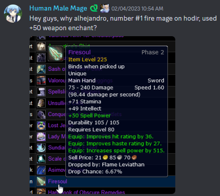

# 🥇Top ranking cope🥇 

_Vivax (Pagle-US) -_ `Discfordge` _(Discord)_+++++++++++++++++

World of Warcraft: Classic 
Wrath of the Lich King (WOTLK)

## 🥈Preamble🥈

> "What are the top DPS rankings for my class doing?"

This question, usually followed by looking at a couple top DPS logs (read: "Top parses" or "Top rankings") for your boss of preference, will lead to wildly over-represent what is not always a proper example of "good" class-specific gameplay, nor that of class-specific *min-maxing*.(regardless of it being personal/selfish *min-maxing* or not). 

> "Wait, why is the #1 DPS on Gigachad not using enchants? What?"

For example: Easy but *"extra"* things one can do for higher DPS (WCL approved✅) such as using tailoring cloth-crafting buffs, pre-summoning guardians, or receiving external buffs (Power Infusion, Focus Magic, among others) should in theory always be a DPS increase *minor or major*, and you will see them being used in **__"some"__**, but not all, of top rankings logs.

 
*Figure 1: My brother in Thrall, may I introduce you to my lord and savior, Vanquished Clutches of Yogg-Saron?*

You don't **__"need"__** these things to have a higher DPS (you probably have other much more important things that you should fix first), however can add to your DPS with them (*min-max?*), which will make it **__"more likely"__** for you to have a higher DPS than what would have been possible without any of them. *(until a bad RNG and bad proc lineup makes you call for a wipe)*

 
*Figure 2: ~170 DPS over a 2:22 minutes fight? Sounds good to me, idk about you Source: https://classic.warcraftlogs.com/reports/a:bBYJa6GTdQrMm8y2#fight=3&type=damage-done&source=8*

It is easy to assume the majority of top rankings are doing everything in their hand to maximize their DPS, but some min-maxing strategies tend to be more common than others, and not all of them will be as impactful.

 
*Figure 3: During the first weeks of Ulduar P2 (WOTLK Classc), Ahlejandro weapon did not had the best enchant available. He ranked #1 on Hodir.*

Another issue when looking for what the top rankings are doing "different" by *glancing* over their logs is that we might fail to notice critical raid-wide factors that contributed to that ranking being possible.

For example, class-stacking sometimes is needed to meet specific DPS thresholds to skip entire mechanics or boss phases. You could die (in-game) before the end of the fight and still rank decently well.

 
*Figure 4: Example of a "normal" raid comp for Twins Valk'yr: https://classic.warcraftlogs.com/reports/yn72Dgwq3fc41d9B#fight=30&type=damage-done Shared by Simonize in his discord*

Back in World of Warcraft: Classic - The Burning Crusade (TBC), when we were able to receive multiple Lusts per fight and [before the PI External Cap was implemented](https://articles.classic.warcraftlogs.com/news/classic-blog-externals-cap-and-more), you could see some top rankings stacking as many external buffs as possible

While they were not the majority, in some cases you would see them grossly misplaying their class, and what would have meant losing any chance at achieving a high ranking by an average player, those stacking buffs easily "compensated" for it. 

 
*Figure 5: You may not like it, but this is what peak TBC parsing looks like*

It can be useful and interesting to use data from the top rankings/parsing/logs to see trends and the extend of some min-maxing techniques, however one has to be careful on how this can or not be extrapolated more generally.

Not all top rankings are solely attributed to "exceptional class-specific gameplay" or intense min-maxing.  
Frequently, other raid-wide factors impact your ranking much more than individual decisions or buff assignments. 
Or, maybe, just maybe, they simply are better than you (git gud).
~~you could also conspire about a lot of logs possibly being massively AI generated but we will never know~~

## 🥉Introduction🥉

The following data collection is called the **__cope collection__**.

Choose whatever metric you like and use it to argue about it however you like. 

It is cope anyways.

# Table of Contents 📜

1. [Mages](#mage-rankings-top-300) 
2. [Affliction Warlocks](#affliction-warlocks-rankings-top-300) 
3. [Shadow Priests](#shadow-priest-rankings-top-300) 
4. [Balance Druids](#balance-druid-rankings-top-300) 

## Mage Rankings (Top 300)

> Full repository for Mage: https://github.com/ForgeGit/mage_cope

## Affliction Warlocks Rankings (Top 300)

> Full repository for Affliction Warlock: https://github.com/ForgeGit/lock_cope

## Shadow Priest Rankings (Top 300)

> Full repository for Shadow Priest: https://github.com/ForgeGit/priest_cope

## Balance Druid Rankings (Top 300)

> Full repository for Balance Druid: https://github.com/ForgeGit/druid_cope

## Recent Changelog

- 13/09/2023: 
    - Affliction buff metrics were under reporting FM and Tailoring buffs. (Fixed)
        
    - Mage buff metrics were under reporting Tailoring buffs. (Fixed)
        
    - Mage main "infographic" was updated to better resolution for discord sharing. (?) (Fixed)
        
    - Added Spriest and Boomie
        
## To-dos?

- Date distribution in which the parses occurred. 
- ?????
