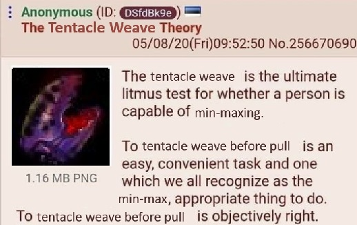
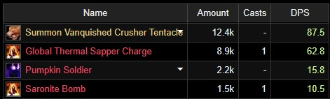
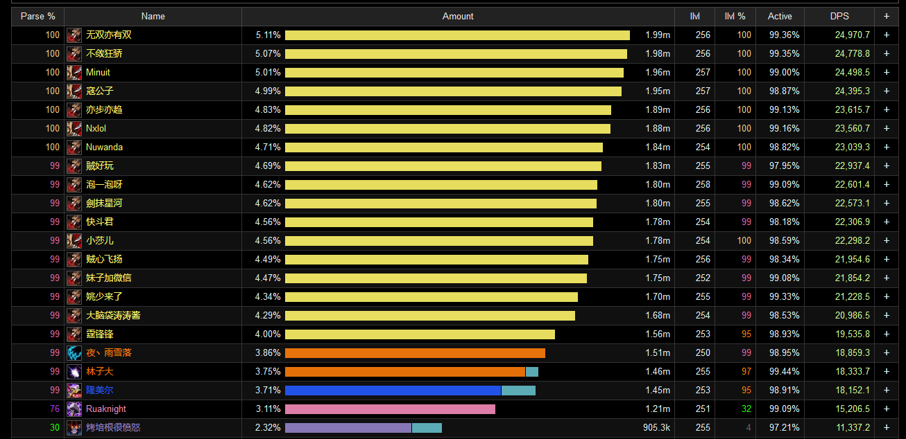
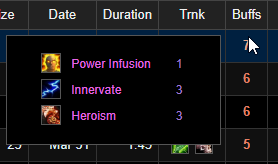
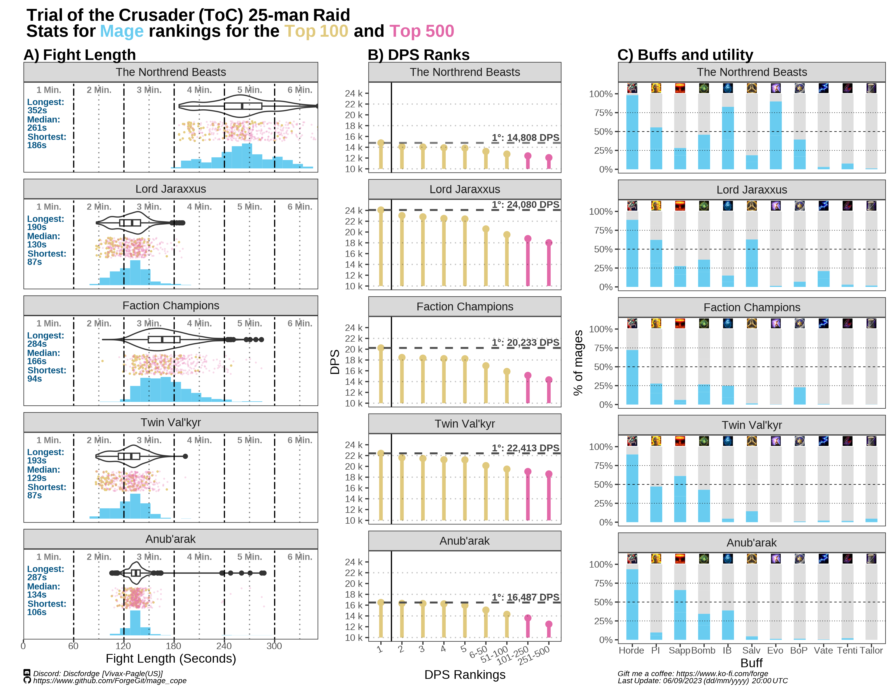
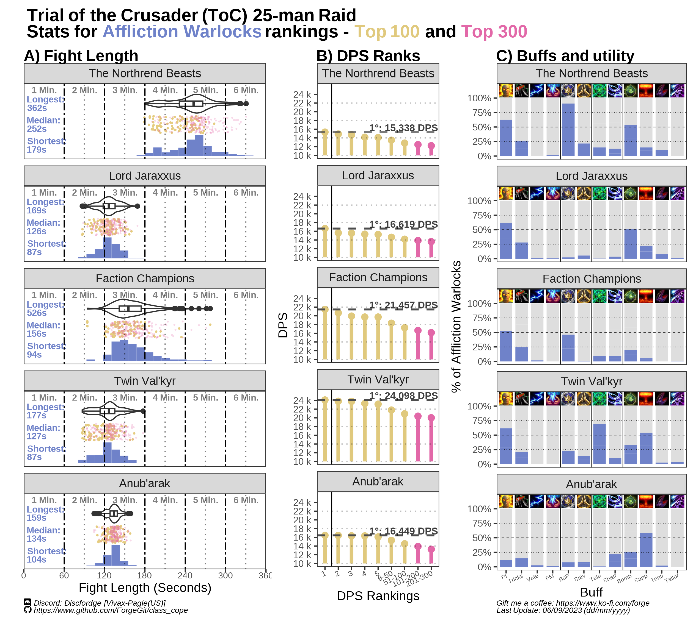

# 🥇Top ranking cope🥇 

_Vivax (Pagle-US) -_ `Discfordge` _(Discord)_

> "What are the top DPS rankings for my class doing?"

This question, usually followed by looking at a couple top DPS logs (read: "Top parses" or "Top rankings") for your boss of preference, will lead to wildly over-represent what is not always proper examples of "good class-specific gameplay", nor that of class-specific *min-maxing* (regardless of it being personal (selfish) *min-maxing* or not). 

For example: Easy things one can do for higher DPS (WCL parsing approved✅) such as using tailoring cloth-crafting buffs, pre-summoning guardians, or receiving external buffs (Power Infusion, Focus Magic, among others) should always be a DPS increase *minor or major*, and you will see them being used in **__"some"__** of the top rankings logs. However, this won't always be the case.

 
*Figure 1: My brother in Thrall, may I introduce you to my lord and savior, Vanquished Clutches of Yogg-Saron?*

You don't **__"need"__** these things to have a higher DPS (you probably have other things with much more impact that you should improve on first), however adding to your DPS (*min-maxing*) with some of these extra buffs will make it __more likely__ for you to have a higher DPS than what would have been possible without any of them.

 
*Figure 2: ~170 DPS over a 2:22 minutes fight? Sounds good to me, idk about you Source: https://classic.warcraftlogs.com/reports/a:bBYJa6GTdQrMm8y2#fight=3&type=damage-done&source=8*

MORE BUFFS = MORE POSSIBLE DPS = MORE LIKELY TO PARSE *(until a bad RNG and bad proc lineup makes you call for a wipe)*

A lot of the time some of the things you see in top parses would also be impossible for your own raid-conditions. For example, class-stacking sometimes is needed to meet specific DPS threshold to skip entire mechanics or boss phases.

 
*Figure 3: Example of a "normal" raid comp for Twins Valk'yr: https://classic.warcraftlogs.com/reports/yn72Dgwq3fc41d9B#fight=30&type=damage-done Shared by Simonize in his discord*

Back in World of Warcraft: Classic - The Burning Crusade (TBC), when you could stack lust one after another, you would see some top rankings stacking externals. 

While not necessarily the "majority", in some cases this was done to "compensate"" for lack of skill or better raiders. ~~Or you could say that maybe a lot of logs are massively AI generated and we don't know~~

 
*Figure 4: You may not like it, but this is what peak TBC parsing looks like*

It can be useful and interesting to use data from the top rankings/parsing/logs to see trends and some curious min-maxing techniques, however one has to be careful on how this can or not be extrapolated more generally.

Not all top rankings are the result of "good class-specific gameplay", or extremely sweaty class-specific min-maxing.  
A lot of the times, other raid-wide factors influence your ranking much more than individual decisions or buff assignments. (Fight length, class comp, raid-wide buffs and debuffs).

This is why this is called the **__cope collection__**.

Choose whatever metric you like and use it to argue about it however you like. 

It is cope anyways.

# Table of Contents 📜

1. [Affliction Lock](#) 
2. [Mage](#) 

## Mage Rankings (Top 500)

 

## Affliction Warlocks Rankings (Top 500)

 
